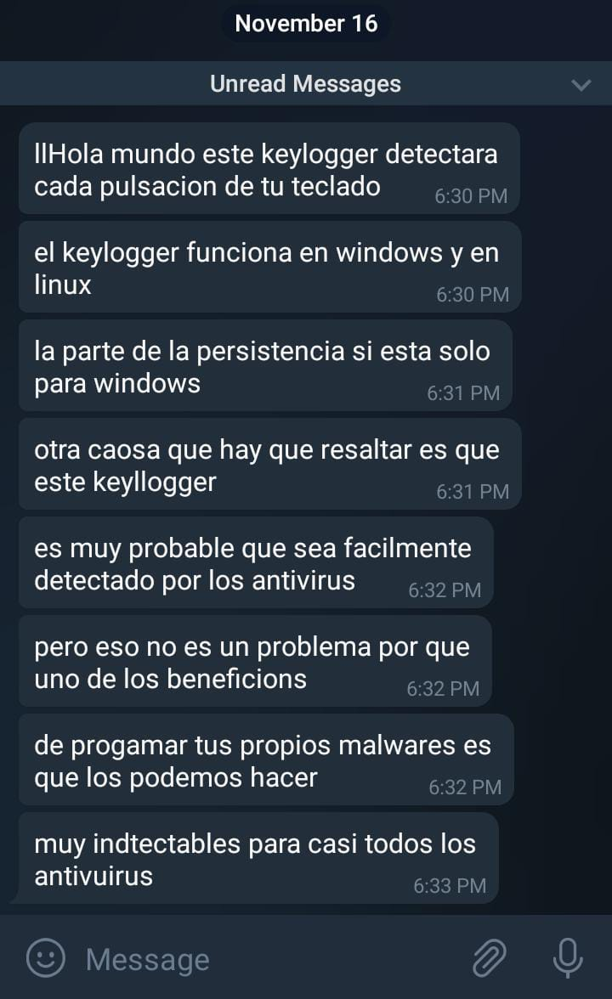

# KeyloggerST0707
Keylogger para windows y linux 

Bueno este keylogger esta enfocado para usuarios windows por la persistencia claro que tambien funcionara en linux
pero no creara la persistencia en usuarios linux, tambien esta pensado para que la primera vez que sea ejecutado se esconda en una ruta especifica, creara la persistencia y se cerrara sin ningun aviso, esto para que la victima
lo pueda eliminar si lo desea y no levantar sospechas pero una vez el computador sea reiniciado o encendido nuevamente, el keylogger 
se va ejecutar esto gracias a la persitencia y ahi verifica si esta parado en la ruta donde lo escondimos y si es asi seguira corriendo normalmente.

Bueno otra cosa es que debemos pasar este keylogger a un .exe para poderlo ejecutar con tan solo
dos click's en windows,tambien debemos configurar un chatBot en telegram y poner tu token por que ahi te llegara todas las pulsaciones
puede tratar de embeber en un archivo y hacerlo indectetable troyanizando asi el keylogger en un archivo claro esta que antes debemos trabajar
un poco mas en el codigo para cambiarle el comportamiento y el nombre de variables o codificarlo para poder asi bypasear los antivirus

